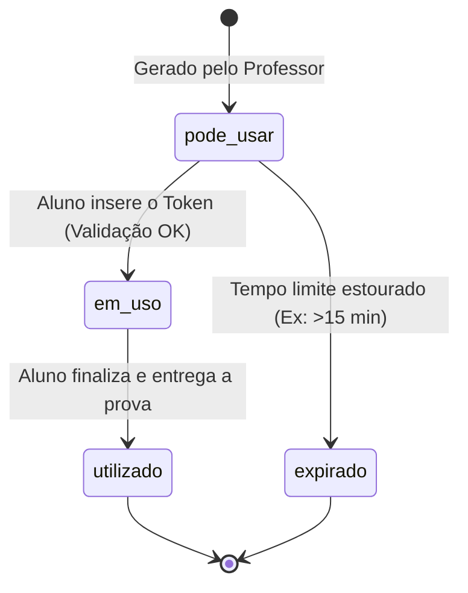

# Plano de Aula: Segurança e Controle de Acesso em Avaliações Digitais com Tokens Temporários

**Duração Estimada:** 50 a 90 minutos  
**Público-alvo:** Alunos de Ciência da Computação, Análise e Desenvolvimento de Sistemas, Engenharia de Software ou Educadores/Aplicadores de Tecnologia Educacional.  
**Nível:** Intermediário  

---

## 🎯 Objetivos de Aprendizagem

Ao final desta aula, os alunos serão capazes de:
1. Compreender a importância da **autenticação temporária** e do **controle de sessão** em ambientes de avaliação.
2. Identificar vulnerabilidades em sistemas de provas online sem controle de token.
3. Explicar o **ciclo de vida de um token temporário** (`pode_usar`, `em_uso`, `utilizado`, `expirado`).
4. Comparar a implementação baseada em **Estado no Banco de Dados (Stateful)** vs **JWT (Stateless)**.
5. Implementar um gerador de token seguro com alta entropia em código (Python / JavaScript).

---

## 📌 1. Introdução e Contextualização (10 min)

### O Problema do Acesso Descontrolado
Imagine a seguinte situação em uma prova presencial ou EAD:
- A prova é disponibilizada no sistema às 08:00.
- Alunos que não estão na sala de aula acessam a prova antes da hora ou de suas casas.
- Alunos compartilham o link de acesso com terceiros fora do horário.
- Alunos iniciam a prova em múltiplos navegadores/dispositivos para colar ou capturar questões.

### A Solução: Token Temporário de Acesso
O **Token de Prova** funciona como uma **chave física temporária**. Ele é liberado pelo professor ou aplicador no momento exato da prova (em sala de aula ou polo) e possui um **tempo de expiração curto** (ex: 15 minutos).

---

## 🛡️ 2. Motivos e Benefícios do Uso do Token (15 min)

1. **Segurança e Prevenção de Fraudes**: Impede que a avaliação seja iniciada fora do ambiente ou horário autorizado.
2. **Sincronização e Controle de Turma**: Garante que todos os alunos comecem a prova simultaneamente após a liberação do aplicador.
3. **Sessão Única por Candidato**: Evita que o mesmo usuário acesse a prova de dois computadores simultaneamente.
4. **Validade Criptográfica Temporária**: Se o aluno se atrasar além do limite de expiração (ex: 15 min), o token perde a validade, exigindo liberação ativa do professor.
5. **Rastreabilidade e Auditoria**: Cada resposta fica vinculada ao registro do token com timestamp e IP.

---

## 🔄 3. Ciclo de Vida e Máquina de Estados do Token (15 min)

O token passa por um ciclo de vida rigoroso controlado pelo sistema:



### Detalhando os Estados:
- **`pode_usar`**: O token foi criado no banco de dados, tem horário de validade futuro e ainda não foi ativado pelo aluno.
- **`em_uso`**: O aluno inseriu o token com sucesso. O caderno de questões é liberado e novas tentativas de login com o mesmo token são bloqueadas.
- **`utilizado`**: A avaliação foi encerrada. O token é inativado permanentemente.
- **`expirado`**: A janela de tempo encerrou antes da validação. O aluno precisará de um novo token.

---

## 💻 4. Estrutura de Banco de Dados e Código (20 min)

### Modelagem da Tabela de Tokens (`tokens_prova`)

| Campo | Tipo | Descrição |
| :--- | :--- | :--- |
| `id` | INT / UUID | Chave primária única |
| `user_id` | VARCHAR | Identificador do aluno (RA/Matrícula) |
| `exam_id` | VARCHAR | Código da Prova |
| `token` | VARCHAR(16) | Código hash ou alfa-numérico criptográfico |
| `status` | ENUM | `pode_usar`, `em_uso`, `utilizado`, `expirado` |
| `created_at` | DATETIME | Data e hora de criação |
| `expires_at` | DATETIME | Data limite para validação inicial |

---

### Exemplo de Algoritmo de Geração (Python Criptográfico)

> 💡 **Dica de Aula**: Enfatize o uso de bibliotecas de criptografia real (`secrets` em Python ou `crypto.getRandomValues()` em JS), evitando funções frágeis como `random.randint()`.

```python
import secrets
import datetime

def criar_token_prova(usuario_id: str, prova_id: str, minutos_validade: int = 15):
    # Gera uma string aleatória de alta entropia de 8 caracteres alfanuméricos
    token_seguro = secrets.token_hex(4).upper()
    
    # Define a data/hora exata de expiração (Tempo Atual + 15 min)
    agora = datetime.datetime.now(datetime.timezone.utc)
    expiracao = agora + datetime.timedelta(minutes=minutos_validade)
    
    registro_token = {
        "user_id": usuario_id,
        "exam_id": prova_id,
        "token": token_seguro,
        "status": "pode_usar",
        "created_at": agora.isoformat(),
        "expires_at": expiracao.isoformat()
    }
    
    return registro_token

# Exemplo de saída:
# Token: 8F1D2E4A | Válido até: 15 minutos a partir de agora
```

---

## ⚖️ 5. Comparativo Arquitetural: Tokens no Banco vs JWT (15 min)

Existem duas formas principais de implementar essa solução na arquitetura de software:

### Abordagem A: Armazenamento em Banco / Cache (Stateful)
- **Como funciona**: Cada token é gravado no banco de dados (ou Redis) e consultado a cada requisição.
- **Vantagem**: Controle total! Permite cancelar ou revogar tokens individualmente em tempo real.
- **Desvantagem**: Exige chamadas constantes ao banco de dados.

### Abordagem B: JWT - JSON Web Tokens (Stateless)
- **Como funciona**: O backend assina digitalmente um token contendo `{ user_id, exam_id, exp }`. O cliente guarda esse token e envia nos cabeçalhos.
- **Vantagem**: Alta performance; o servidor não precisa consultar o banco para validar a assinatura e a expiração.
- **Desvantagem**: Dificuldade em revogar um token específico antes que ele expire naturalmente.

---

## 📝 6. Exercício Prático / Estudo de Caso para os Alunos

**Cenário**: Durante uma prova com 500 alunos simultâneos, a internet do polo presencial caiu aos 10 minutos de prova. Quando a conexão voltou, o tempo de 15 minutos do token já havia expirado para 40 alunos que ainda não tinham entrado.

**Perguntas de Discussão para a Turma**:
1. O que acontece com o status desses 40 tokens no banco de dados?
2. Como o sistema do professor deve ser projetado para resolver esse incidente com segurança e agilidade?
3. *(Desafio de Código)* Escreva a query SQL ou função para renovar em lote (`bulk-update`) a expiração apenas dos alunos afetados.

---

## 📚 Materiais Complementares
- Código da Aplicação Interativa em HTML/JS/CSS no repositório do projeto.
- Documentação da biblioteca `secrets` (Python) / Web Crypto API (JavaScript).
